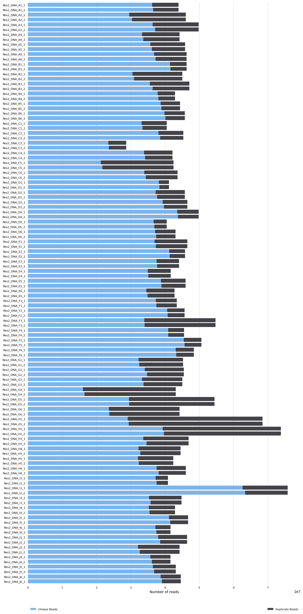

# Raw sequences downloaded

## Note

Right now I do not have a plan to use the RNA-seq data. So I will not quality control it.

## Files

 

## Directories

 * 0_Trimmed_DNA : trimmed metagenomic sequence
 * 1_Trimmed_RNA : trimmed metatranscriptomics
 * 2_Trimmed_Phage : trimmed virome metagenomics
 * 3_Decontaminated_DNA : removed human decontamination metagenomic sequence
 * 4_Decontaminated_RNA : removed human decontamination metatranscriptomics
 * 5_Decontaminated_Phage : removed human decontamination virome metagenomics
 * 6_PreQC_FASTQC : Output of QC reports before trimming
 * 7_PostQC_FASTQC : Output of QC reports after trimming
 

## Scripts + Batch Jobs

 * pre_fastq_DNA.sh
 * pre_fastq_RNA.sh
 * pre_fastq_Phage.sh
 * pre_fastqc_multiqc.sh 

## Tools Used
 
 * FastQC v.0.11.9 (https://www.bioinformatics.babraham.ac.uk/projects/fastqc/) 
 * MultiQC v.1.11 (https://multiqc.info/)

### Sample naming

Samples appear to be distinguished by 'library_name'

`Res2_<Type>_<a-z><d>`

* Type
  * Phage : Virome samples
  * RNA : Metatranscriptomics
  * DNA : Micorbial Sequencing
* [A-J]
  * A : Doxycycline
  * B : Ciprofloxacin
  * C : Control
  * D : Azithromycin
  * E : Control
  * F : Cefuroxime
  * G : Azithromycin
  * H : Ciprofloxacin
  * I : Doxycycline
  * J : Cefuroxime
* [1-6]
  * 1 : Baseline (Day -15)
  * 2 : Treatment1 (Day 3)
  * 3 : Treatment2 (Day 5)
  * 4 : Post-treatment (Day 15)
  * 5 : Post-treatment (Day 30)
  * 6 : Post-treatment (Day 90)

Note: Sample J5 does not exist for any of the samples. So there are 58 paired sequences per 'omic'

## Decontaminating and Trimming Reads

### Information about the reads
DNA library preparation and sequencing:  
Illumina HiSeq 2000 PE125 using TrueSeq Nano 550 bp kits (Illumina)
Phage DNA : MiSeq PE300  

### Step 1 : FASTQC sequences before QC for comparison
This step will help us see how well the QC steps did and if there are any initial issues

I ran each DNA, RNA and Phage seperately as SBATCH jobs
```shell
sbatch pre_fastq_DNA.sh
sbatch pre_fastq_RNA.sh
sbatch pre_fastq_Phage.sh
```
The results were stored in 6_PreQC_FastQC in their respective folders (DNA, RNA, Phage)

FASTQC makes a file per sample which is annoying to check them all simultaneously
so I will run multiqc per DNA, RNA and Phage which pools samples together

I will run it using:
pre_fastqc_multiqc.sh

```shell
sbatch pre_fastqc_multiqc.sh
```

This will take all .html files from FASTQC and make
<type>_multiqc_report_data (directory)
<type>_multiqc_report.html (file)
<type>_multiqc_report_plots (directory)

These files are stored 
```shell
1_QCReads/6_PreQC_FASTQC/<type>
```
I would recommend looking at multiqc_report.html files as they are easy to digest in the browser.
I will go over all the issues that reported and compare them before and after using Trimmomatic.

Trimmomatic will help me remove adapters left over from the sequence length, trim near ends of sequence where quality drops off, and remove low quality reads.

Bacterial sequences quality pre-trimming  

