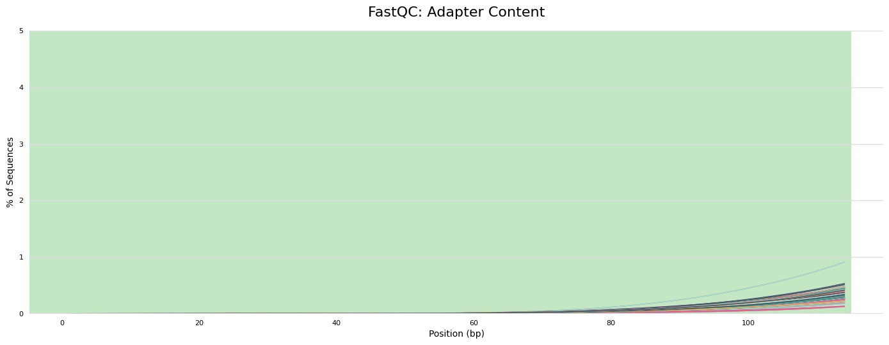

# Raw sequences downloaded

## Note

Right now I do not have a plan to use the RNA-seq data. So I will not quality control it.

## Files

 * DNA_IDs.txt : List of all the DNA sample IDs
 * Phage_IDs.txt : List of all the Phage sample IDs

## Directories

 * 0_Trimmed_DNA : trimmed metagenomic sequence
 * 1_Trimmed_RNA : trimmed metatranscriptomics
 * 2_Trimmed_Phage : trimmed virome metagenomics
 * 3_Decontaminated_DNA : removed human decontamination metagenomic sequence
 * 4_Decontaminated_RNA : removed human decontamination metatranscriptomics
 * 5_Decontaminated_Phage : removed human decontamination virome metagenomics
 * 6_PreQC_FASTQC : Output of QC reports before trimming
 * 7_PostQC_FASTQC : Output of QC reports after trimming
 

## Scripts + Batch Jobs

 * pre_fastq_DNA.sh
 * pre_fastq_RNA.sh
 * pre_fastq_Phage.sh
 * pre_fastqc_multiqc.sh
 * trimmomatic_viral.sh
 * trimmomatic_bacteria.sh 

## Tools Used
 
 * FastQC v.0.11.9 (https://www.bioinformatics.babraham.ac.uk/projects/fastqc/) 
 * MultiQC v.1.11 (https://multiqc.info/)
 * Trimmomatic v.0.39 (http://www.usadellab.org/cms/?page=trimmomatic)

### Sample naming

Samples appear to be distinguished by 'library_name'

`Res2_<Type>_<a-z><d>`

* Type
  * Phage : Virome samples
  * RNA : Metatranscriptomics
  * DNA : Micorbial Sequencing
* [A-J]
  * A : Doxycycline
  * B : Ciprofloxacin
  * C : Control
  * D : Azithromycin
  * E : Control
  * F : Cefuroxime
  * G : Azithromycin
  * H : Ciprofloxacin
  * I : Doxycycline
  * J : Cefuroxime
* [1-6]
  * 1 : Baseline (Day -15)
  * 2 : Treatment1 (Day 3)
  * 3 : Treatment2 (Day 5)
  * 4 : Post-treatment (Day 15)
  * 5 : Post-treatment (Day 30)
  * 6 : Post-treatment (Day 90)

Note: Sample J5 does not exist for any of the samples. So there are 58 paired sequences per 'omic'

## Decontaminating and Trimming Reads

### Information about the reads
DNA library preparation and sequencing:  
Illumina HiSeq 2000 PE125 using TrueSeq Nano 550 bp kits (Illumina)
Phage DNA : MiSeq PE300  

### Step 1 : FASTQC sequences before QC for comparison
This step will help us see how well the QC steps did and if there are any initial issues

I ran each DNA, RNA and Phage seperately as SBATCH jobs
```shell
sbatch pre_fastq_DNA.sh
sbatch pre_fastq_RNA.sh
sbatch pre_fastq_Phage.sh
```
The results were stored in 6_PreQC_FastQC in their respective folders (DNA, RNA, Phage)

FASTQC makes a file per sample which is annoying to check them all simultaneously
so I will run multiqc per DNA, RNA and Phage which pools samples together

I will run it using:
pre_fastqc_multiqc.sh

```shell
sbatch pre_fastqc_multiqc.sh
```

This will take all .html files from FASTQC and make
<type>_multiqc_report_data (directory)
<type>_multiqc_report.html (file)
<type>_multiqc_report_plots (directory)

These files are stored 
```shell
1_QCReads/6_PreQC_FASTQC/<type>
```
I would recommend looking at multiqc_report.html files as they are easy to digest in the browser.
I will go over all the issues that reported and compare them before and after using Trimmomatic.

Trimmomatic will help me remove adapters left over from the sequence length, trim near ends of sequence where quality drops off, and remove low quality reads.

Bacterial sequences quality pre-trimming  

Phage sequences quality pre-trimming, there seems to be more issues as the length of sequences are longer


There doesn't seem to be an issue with adapters with the bacteria or phage but like low-quality position it appears to slightly increase near end of read, which makes sense
Bacteria sequences adapter contamination

Phage sequences adapter contamination


I would also look at the MultiQC file, as it has a status checks for each category. Which is a nice summary. So now I will run Trimmomatic

### Step 2 : Trimmomatic
For the adaptors I will use the default Trimmomatic::TruSeq2-PE, 
the universal adapter sequence of TruSeq kit as:
Illumina HiSeq 2000 PE125 using TrueSeq Nano 550 bp kits (Illumina)
Phage DNA : MiSeq PE300

I will use 'palindrome mode' which is aimed at detecting 'adapter read-through' which is is prevelant in the long read length of MiSeq which we see in the Phage DNA samples.
I will run similar analysis as previously used on this dataset (re:Kang et al 2021) 
Removing low quality bases (<Q20); reads shorter than 75bp
1) remove adapters ILLUMINACLIP:TruSeq3-PE.fa:2:30:10:8:keepBothReads
2) remove reads below a Phred score of 20 with a sliding window of 4 SLIDINGWINDOW:4:20
3) I will set a minimum length for MINLEN:75
4) I will also run it on four CPUs

I will need to run trimmomatic on each sample individually, so I will make a file that has all the DNA and Phage ID names:

```shell
$ cut -f7 ../0_RawData/filereport_read_run_PRJNA588313.txt | grep 'DNA' > DNA_IDs.txt
$ head DNA_IDs.txt
Res2_DNA_B6
Res2_DNA_B5
Res2_DNA_A2
Res2_DNA_A1
Res2_DNA_B4
Res2_DNA_B3
Res2_DNA_B2
Res2_DNA_B1
Res2_DNA_J6
Res2_DNA_J5
$ cut -f7 ../0_RawData/filereport_read_run_PRJNA588313.txt | grep 'Phage' > Phage_IDs.txt
$ head Phage_IDs.txt
Res2_Phage_B4
Res2_Phage_B3
Res2_Phage_B2
Res2_Phage_B1
Res2_Phage_J6
Res2_Phage_J5
Res2_Phage_J4
Res2_Phage_J2
Res2_Phage_J1
Res2_Phage_I6
```

I will use these files to run trimmomatic on each of the samples.
I will run DNA and Phage in two different batch jobs
viral_trimmomatic.sh
bacteria_trimmomatic.sh
The final script will look like this:
```shell
#Raw reads directory in relation to the script
input_directory=../0_RawData/2_Phage/
#Output directory in relation to the script
output_directory=2_Trimmed_Phage/

#Each line of Phage_IDs.txt is a sample
cat Phage_IDs.txt | while read id

do

java -jar $EBROOTTRIMMOMATIC/trimmomatic-0.39.jar PE -threads 8 ${input_directory}${id}_1.fastq.gz ${input_directory}${id}_2.fastq.gz   ${output_directory}trimmed_${id}_1_paired.fastq.gz \
${output_directory}trimmed_${id}_1_unpaired.fastq.gz ${output_directory}trimmed_${id}_2_paired.fastq.gz \
${output_directory}trimmed_${id}_2_unpaired.fastq.gz \
ILLUMINACLIP:$EBROOTTRIMMOMATIC/adapters/TruSeq3-PE.fa:2:30:10:8:keepBothReads SLIDINGWINDOW:4:20 MINLEN:75

done
```
I will do the bacteria version in batch script trimmomatic_bacteria.sh

