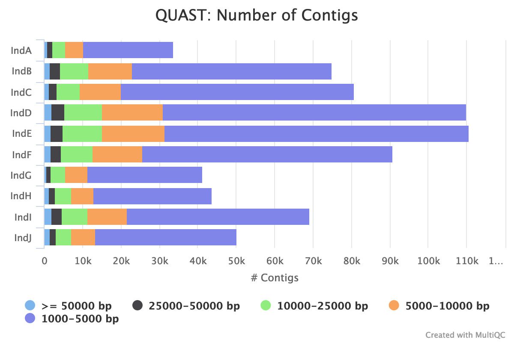
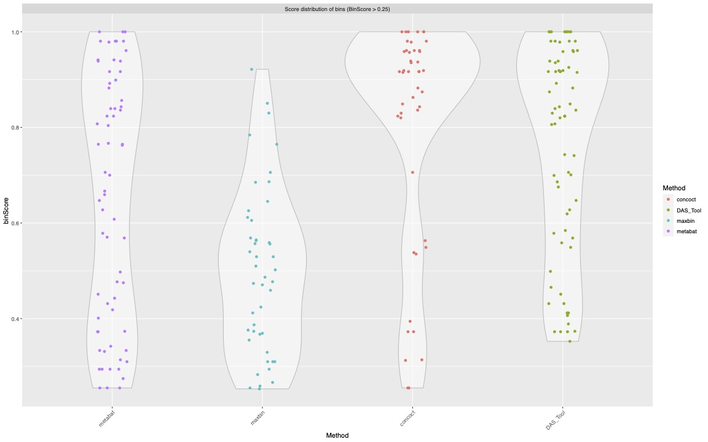

# Bacterial Analysis

## Note
For now this process is assembling bacterial contigs that will be the scaffolds for binning as I am mostly interested in bacterial bins for prophage detection.
Decontaminated/Trimmed sequences are in 1_QC_Reads/3_Decontaminated_DNA

I have decided to do a little experiment. Initially, I had been planning on aligning all the reads of an individual to their assembled contigs for  
for bacterial binning but after talking to a colleague maybe per sample coverage file might give different bins. I will make a second bacterial binning  
folder for it 3_Experimental_bacterial_binning.

For storage sake I deleted .sam files for bowtie2 after making bam files. To save on space.
  
## Files

*  DAS_Check_Bins_Ind[A-J].tsv : Summary of all the bins that met our criteria of medium-quality
*  7_Relative_Abundance/Data/Ind{A..J} : Collection of files used in relative abundance analysis of bacteria.

## Directories

*  0_Stored_Standard_Outputs : Each script generates a standard output. To declutter I am moving them here after the step is complete.
*  1_Assembled_Contigs : Output of all the megahit assembly per individual [Once again the fasta files are too large to upload to Github]
*  2_Bacterial_Binning : Parent directory for subdirectories of each binning tool
*  3_Experimental_bacterial_binning : This folder I will try using a different coverage approach (aligning reads per sample per individual) 
*  4_Stored_BASH_scripts : After a step is done I moved the BASH script for the job here to be more organized.
*  5_Final_Bins : Bins used in downstream analysis after QC
*  6_Bacterial_taxonomy : We will use GDTB-Tk and determine the taxonomy of each final bacterial bin
*  7_Relative_Abundance : We will also determine the relative abundance of each bacterial bin per sample per individual

## Scripts + Batch Jobs
Finished jobs are found here in 4_Stored_BASH_scripts but should be run from this directory.

*  bacterial_assembly[A-J].sh : Using megahit to assemble reads into contigs per individual 
*  metaQUAST_[A-J].sh : QC summary of Assembly Step
*  prebinning_bowtie2_[A-J].sh : Binning relies on contig coverage I will use this to make the sorted bam files for metabat2
*  assembly_multiqc.sh : amalgamates each individuals quast results for assembly
*  CONCOCT_[A-J].sh : Runs all steps required for CONCOCT binning of assembled contigs
*  maxbin2_[A-J].sh : Runs MaxBin2 on all assembled contigs to bin them
*  metabat2_[A-J].sh : Runs MetaBat2 binner on all assembled contigs
*  DAS-Tool_[A-J].sh : Takes all bins from CONCOCT/MaxBin2/MetaBat2 and merges them into bins
*  Combining_CheckM_DAS_Tool.R : Combines DAS-Tool and CheckM QC on Bins, and makes a table with bins that pass per individual, and their new bin name
*  Renaming_Bacterial_Bins.py : Python script to rename 5_Final_Bins according to DAS_Check_Bins_Ind[A-J].tsv files that store their new names and which bins met our cut-off
*  bacterial_samtools_coverage_profile_{A..J}.sh : Use samtools coverage to convert bowtie2 bam file to a smaller more parsable format for R

## Tools Used

*  megahit v.1.2.9(https://github.com/voutcn/megahit)
*  metabat2 v.2.14(https://bitbucket.org/berkeleylab/metabat/src/master/)
*  bowtie2 v.2.4.2(http://bowtie-bio.sourceforge.net/bowtie2/index.shtml)
*  quast v.5.0.2(http://bioinf.spbau.ru/quast)
*  DAS Tool v.1.1.2(https://github.com/cmks/DAS_Tool)
*  CONCOCT v.1.1.0(https://concoct.readthedocs.io/en/latest/#)
*  MaxBin2 v.2.2.7(https://sourceforge.net/projects/maxbin2/)
*  CheckM v.1.0.18(https://github.com/Ecogenomics/CheckM/wiki)
*  samtools v.1.12
     * coverage (http://www.htslib.org/doc/samtools-coverage.html)

### Sample naming

* [A-J]
  * A : Doxycycline
  * B : Ciprofloxacin
  * C : Control
  * D : Azithromycin
  * E : Control
  * F : Cefuroxime
  * G : Azithromycin
  * H : Ciprofloxacin
  * I : Doxycycline
  * J : Cefuroxime
* [1-6]
  * 1 : Baseline (Day -15)
  * 2 : Treatment1 (Day 3)
  * 3 : Treatment2 (Day 5)
  * 4 : Post-treatment (Day 15)
  * 5 : Post-treatment (Day 30)
  * 6 : Post-treatment (Day 90)

Note: Sample J3 does not exist for any of the samples. So there are 59 paired sequences per 'omic'

### Step 1: Bacterial Assembly

Reads will be assembled per individual in the study at time points [1-6]
Individuals are [A-J]
Samples are named:
Res2_DNA_A1_paired_decontaminated.fastq.1.gz
Res2_DNA_A1_paired_decontaminated.fastq.2.gz
For Individual A time point 1

I need to iterate over 1-6 (except for individual J) then run the command on all reads for each individual. The script looks like this:

```shell
#QC reads directory in relation to the script
input_directory=../1_QCReads/3_Decontaminated_DNA/
#Output directory in relation to the script
output_directory=1_Assembled_Contigs

#Individual Code
ind=A

#Sequence list
pe1=$(for i in {1..6}; do echo -n "${input_directory}Res2_DNA_${ind}${i}_paired_decontaminated.fastq.1.gz,"; done)
pe2=$(for i in {1..6}; do echo -n "${input_directory}Res2_DNA_${ind}${i}_paired_decontaminated.fastq.2.gz,"; done)

#Notes: megahit hates spaces and needs commas between each sample
#This is why echo -n (removes space between sample names)
#${pe1::-1} (gets rid of last comma)

# megahit [options] {-1 <pe1> -2 <pe2> | --12 <pe12> | -r <se>} [-o <out_dir>]

run=$(megahit -t 4 -1 ${pe1::-1} -2 ${pe2::-1} --out-prefix Ind${ind} --min-contig-len 1500 -o ${ind}_megahit_output)

#Couldn't get it to put output in my 1_Assembled_Contigs so I will do it myself
mv ${ind}_megahit_output ${output_directory}
```
Then I will just make a script for each individual so I can run them faster. Also, modify Individual J so that it runs {1,2,3,4,6} instead.
After running it on individual these were the stats:
Assembly is an intensive step but running with MEGAHIT (which is fast an low memory requirement) can parallelized well. Here are the stats for individual A

```shell
Cores per node: 12
CPU Utilized: 1-09:25:29
CPU Efficiency: 84.70% of 1-15:27:48 core-walltime
Job Wall-clock time: 03:17:19
Memory Utilized: 41.23 GB
Memory Efficiency: 32.99% of 125.00 GB
```
A lot of individuals lead to issues with #TIMEOUT error but memory was less of an issue so to run more efficiently I used 64GB of memory

```shell
Job ID: 13578835
Cluster: cedar
User/Group: ssutclif/ssutclif
State: COMPLETED (exit code 0)
Nodes: 1
Cores per node: 12
CPU Utilized: 1-11:53:16
CPU Efficiency: 84.18% of 1-18:37:48 core-walltime
Job Wall-clock time: 03:33:09
Memory Utilized: 41.17 GB
Memory Efficiency: 64.33% of 64.00 GB
```
### Step 1A: Quality Control on Assembled Contigs
Before binning the assembled bacterial contigs, I will run a quick QC check on them. There is not much different I could do except possibly try Spades assembly (which is slower and more memory intensive but creates slightly better genomes). 
This is not just my opinion but also published.
See [van der Walt et al. 2017](doi.org/10.1186/s12864-017-3918-9)

I will use QUAST v.5.0.2 (available on CC)
Specifically MetaQUAST, the extension for metagenomic datasets.

Notes: I am running the pre-installed version on Compute Canada. It's a python script so after loading it I ran
```shell
which quast.py
```
This gives me the location of the script. I will put this line in my script

```shell
quast=$(which metaquast.py)
```
So when I run the commands they will look slightly different than that which is on the github.
Put the output in 1_Assembled_Contigs/quast_results/results_Ind[A-J]

Note: I kept having trouble getting database option to work due to internet not working on cluster. So an option is to run it with
--max-ref-number 0
So It will still complete
Full script

Like with FastQC results, MultiQC handles QUAST results. So I will run it on all the Individuals so I can see if assembly worked well on my samples
assembly_multiqc.sh

They will be output into 1_Assembled_Contigs/quast_results/
I knew I did not want contigs shorter than 1kb so I didn't keep them but the stats look quite good for what I got.   
  

### 2 Binning Bacterial Assembled Contigs

I will use the approach of using multiple binners Metabat2, Maxbin2 and CONCOCT with DAS-Tool and then QC control with CheckM (combined with DAS-Tool)
Note: Binners operate using coverage maps so Bowtie2 will be generated as a preliminary step for binning
Note: I will run QC after each binner is run and on the DAS-Tool refinement

All this work will be put in parent directory 2_Bacterial_Binning/

Subdirectories for each step
2_Bacterial_Binning/bowtie2  
2_Bacterial_Binning/Metabat2  
2_Bacterial_Binning/Maxbin2  
2_Bacterial_Binning/CONCOCT  
2_Bacterial_Binning/DAS-Tool  
2_Bacterial_Binning/CheckM  


Like assembly each individual will get binning done per individual.


### 2A Binning Bacterial Assembled Contigs: Coverage mapping per contig with Bowtie2

Bowtie results will be in 2_Bacterial_Binning/bowtie2
```shell
$ mkdir 2_Bacterial_Binning/bowtie2/Ind{A..J}
```
prebinning_bowtie2_[A-J].sh
Thes scripts will 1) make an index of assembled contigs per individual 2) align reads from the individual to the assembled contigs 3) sort the sam output 4) convert sorted sam file to bam file

It looks like it worked, with most reads aligning to the contigs. For bowtie2 the standard output makes a nice summary stat, so you don't need to use another tool to get it.
```shell
$ tail -n3  prebinning_bowtie2*out
==> prebinning_bowtie2-14211848.out <==
96.68% overall alignment rate
Finished aligning Sample IndA
[bam_sort_core] merging from 181 files and 1 in-memory blocks...

==> prebinning_bowtie2-14212017.out <==
94.43% overall alignment rate
Finished aligning Sample IndB
[bam_sort_core] merging from 177 files and 1 in-memory blocks...

==> prebinning_bowtie2-14212019.out <==
94.86% overall alignment rate
Finished aligning Sample IndC
[bam_sort_core] merging from 159 files and 1 in-memory blocks...

==> prebinning_bowtie2-14212059.out <==
92.62% overall alignment rate
Finished aligning Sample IndD
[bam_sort_core] merging from 170 files and 1 in-memory blocks...

==> prebinning_bowtie2-14212064.out <==
92.33% overall alignment rate
Finished aligning Sample IndE
[bam_sort_core] merging from 170 files and 1 in-memory blocks...

==> prebinning_bowtie2-14212068.out <==
94.25% overall alignment rate
Finished aligning Sample IndF
[bam_sort_core] merging from 184 files and 1 in-memory blocks...

==> prebinning_bowtie2-14212071.out <==
96.13% overall alignment rate
Finished aligning Sample IndG
[bam_sort_core] merging from 180 files and 1 in-memory blocks...

==> prebinning_bowtie2-14212073.out <==
96.19% overall alignment rate
Finished aligning Sample IndH
[bam_sort_core] merging from 204 files and 1 in-memory blocks...

==> prebinning_bowtie2-14212074.out <==
95.55% overall alignment rate
Finished aligning Sample IndI
[bam_sort_core] merging from 182 files and 1 in-memory blocks...

==> prebinning_bowtie2-14212075.out <==
95.05% overall alignment rate
Finished aligning Sample IndJ
[bam_sort_core] merging from 138 files and 1 in-memory blocks..
```
Also I have a sorted bam file now for every sample

```shell
$ ls 2_Bacterial_Binning/bowtie2/Ind[A-J]/*bam
2_Bacterial_Binning/bowtie2/IndA/IndA_megahit_contig_sorted_coverage.bam
2_Bacterial_Binning/bowtie2/IndB/IndB_megahit_contig_sorted_coverage.bam
2_Bacterial_Binning/bowtie2/IndC/IndC_megahit_contig_sorted_coverage.bam
2_Bacterial_Binning/bowtie2/IndD/IndD_megahit_contig_sorted_coverage.bam
2_Bacterial_Binning/bowtie2/IndE/IndE_megahit_contig_sorted_coverage.bam
2_Bacterial_Binning/bowtie2/IndF/IndF_megahit_contig_sorted_coverage.bam
2_Bacterial_Binning/bowtie2/IndG/IndG_megahit_contig_sorted_coverage.bam
2_Bacterial_Binning/bowtie2/IndH/IndH_megahit_contig_sorted_coverage.bam
2_Bacterial_Binning/bowtie2/IndI/IndI_megahit_contig_sorted_coverage.bam
2_Bacterial_Binning/bowtie2/IndJ/IndJ_megahit_contig_sorted_coverage.bam
```
So now I can start binning.

### 2B Binning Bacterial Assembled Contigs: MetaBat2

Note: For this step the depth.txt file for this step is used in other binning steps.
It is jgi_summarize_bam_contig_depths <sorted_bam_file>

```shell
#Individual
ind=A

module load StdEnv/2020 gcc/9.3.0 metabat/2.14

#megahit contigs
megahit_contigs=1_Assembled_Contigs/${ind}_megahit_output/Ind${ind}.contigs.fa
#sorted bam file for coverage
sorted_bam=2_Bacterial_Binning/bowtie2/Ind${ind}/Ind${ind}_megahit_contig_sorted_coverage.bam
#Output file
output=2_Bacterial_Binning/Metabat2/Ind${ind}_metabat_bins

#Step 1 make the depth file
jgi_summarize_bam_contig_depths --outputDepth ${output}/Ind_${ind}_depth.txt $sorted_bam

metabat -m 1500 -t 4 -i $megahit_contigs -a ${output}/Ind_${ind}_depth.txt -o ${output}
```
Note: There is a mistake here the $output should have been
```shell
output=2_Bacterial_Binning/Metabat2/Ind${ind}_metabat_bins/Ind${ind}_metabat_bins
```
So it puts all the files one directory up. However this still works as each bin will still have a unique name.

### 2B Binning Bacterial Assembled Contigs: MaxBin2

Maxbin2 is loaded on Compute Canada cluster.
We will use the MetaBat2 depth file.
Example of script for Individual A:
NOTE: dont end the output with a /
e.g. out/put/path/
As this will make all files and directories hidden with . starting each file
Also a lot of files simply did not work the first time around.
Check out these files:
nano maxbin2-*outcd
To see how they broke. I'm trying it a second time.
Still files broke.
Michael suggested using it as a singularity.
I will keep trying until they all work

```shell
#Individual
ind=A
echo "Running on Individual $ind"

module load StdEnv/2020 gcc/9.3.0 maxbin/2.2.7

#megahit contigs
megahit_contigs=1_Assembled_Contigs/${ind}_megahit_output/Ind${ind}.contigs.fa

#Output file
output=2_Bacterial_Binning/Maxbin2/Ind${ind}

#Metabat2 depth file
depth=2_Bacterial_Binning/Metabat2/Ind${ind}_metabat_bins/Ind_${ind}_depth.txt

run_MaxBin.pl -contig $megahit_contigs -out ${output} -abund ${depth} -thread 4
```
As with Metabat2 I will make a batch script for each individual.
Note: MaxBin2 gave a lot of errors, that simply required re-running to fix.
Also, I couldn't get the output to go into the proper output directories. So I had to move the files in there after they successfully ran.
```shell
#Individual
ind=A
echo "Running on Individual $ind"

module load StdEnv/2020 gcc/9.3.0 maxbin/2.2.7

#megahit contigs
megahit_contigs=1_Assembled_Contigs/${ind}_megahit_output/Ind${ind}.contigs.fa

#Output file
output=2_Bacterial_Binning/Maxbin2/Ind${ind}

#Metabat2 depth file
depth=2_Bacterial_Binning/Metabat2/Ind${ind}_metabat_bins/Ind_${ind}_depth.txt

run_MaxBin.pl -contig $megahit_contigs -out ${output} -abund ${depth} -thread 4
```
Now they have successfully all been run.
### 2C Binning Bacterial Assembled Contigs: CONCOCT
Note: I have CONCOCT installed in an env located elsewhere in my project space. I had previously used it for a different project. 

CONCOCT; like Metabat2 and Maxbin2 needs and abundance file for the contigs.
It runs more similar to Metabat2 by using the oringal bam file. Except it wants it sorted and indexed. 

I will run it using the basic usage (https://concoct.readthedocs.io/en/latest/usage.html)
You do these steps with a corresponding python script 
1. cut contigs into smaller parts  : cut_up_fasta.py
2. generate coverage table on sorted index file : concoct_coverage_table.py
3. run concoct : concoct
4. merge subcontig clustering : merge_cutup_clustering.py
5. extract bins : extract_fasta_bins.py

It's a little elaborate. Not sure why it is split up this way.
I will run each step in one bash script per individual.

I wont write this one out in full as it is too long:
CONCOCT_A.sh

They all appeared to have worked.

### 2D Binning Bacterial Assembled Contigs: DAS-Tool

Now that we have bins using Metabat2/MaxBin2/CONCOCT we need to merge them together. There are a few tools that do this. We will use DAS-Tool

I've previously installed in my my CEDAR account ~/LIBS/DAS_Tool/

I'm going to run DAS-Tool twice. 1) Using default cut-off 2) Using 0.35 bin score cut-off so I can see if I am losing any bins close to the 0.4 cut-off which is published as being fine.
I will run Check M to see if I lose any medium-high quality bins.

First step of DAS-Tool is to make the input-files needed (tab seperated file of scaffold IDs and bin IDs)
https://github.com/cmks/DAS_Tool#preparation-of-input-files
I will use their Fasta_to_Scaffolds2Bin.sh script.
For CONCOCT I will use a perl one-liner on the .csv file it outputs. This is because
There is an issue:
The contig names from megahit look like this:  
```shell
>k141_98793 flag=1 multi=8.0000 len=1717
```
But the metabat and maxbin did this:
```shell
>k141_14377
```
Whereas CONCOCT keeps the whole name
```shell
>k141_98793 flag=1 multi=8.0000 len=1717
```
So to make the tsv file for CONCOCT I use the perl script.

The output bin ids do not need to match the contig names it seems, it just needs to be the same for all tools.

### Quality Check Binning: CheckM & DAS-Tool
Along with merging bins together DAS-Tool checks the quality of the bins. I used a loose cut-off of 0.35 bin score (default is 0.5 and others use 0.4).

What I plan on doing in the short-term is to take the 0.35 bin score bins and run CheckM on them. To see if any high-quality bins fall in the 0.35-5 bin score space.

I will also align my quality-controlled bacterial reads to each bin to see what level of alignment we get.

Things to revisit :
1.  Use coverage of contigs per sample : right now I pooled all reads from an individual but some days might benefit from binning based on coverage of different days
2.  I would like to show how DAS-Tool worked by looking at quality scores before-after DAS-Tool

In the effort of time I will revisit these if I get a chance. Making an extra effort for assembling the best bins is useful for this project as detecting prophages is enhanced by higher-quality bins.
DAS-Tool makes oututs of quality per binner. So it might be good enough.
For example it includes single-copy gene(SCG), size, contig #, N50, bin score, completeness, and redundancy
It also produces this nice image where you get a sense of how it worked.


So I will start with running CheckM on the bins found in:  
2_Bacterial_Binning/DAS-Tool/0_35

Note: CC has version 1.0.18 of CheckM but I could never get it to work. So I use v1.1.3 that I installed myself.
```shell
module --force purge
module load StdEnv/2020 gcc/9.3.0
module load prodigal pplacer hmmer

module load python/3 scipy-stack
virtualenv $HOME/CheckM_env
source $HOME/CheckM_env/bin/activate

pip3 install checkm-genome --no-index
```

I will run three commands:
1.  lineage_wf : this is the basic command and produces all the output
2.  bin_qa_plot : a feature in 1.0.18 that makes a nice plot of the results of lineage_wf
3.  unique : this ia another quality check to make sure DAS-Tool outputs bins that are unique

Note: checkm bin_qa_plot command doesn't work on newer versions so I loaded v.1.0.18 at the last step to run that specific command

As expected, we see there are bacterial bins that met the DAS-Tool bin score cutoff of 0.35 but do not pass CheckM cutoffs of
>40% complete, and <10% contaminated.


I ran both DAS-Tool and CheckM to deliver their analysis in tab-deliminated form:  
DAS-Tool:2_Bacterial_Binning/DAS-Tool/0_35/IndA/IndA_DASTool_DASTool_summary.txt
CheckM:2_Bacterial_Binning/CheckM/0_35/IndA/checkm_summary_IndA

Currently I am not familiar enough to run R in an interactive session of the analysis. I will make all these files available on the Github repo  
I will be downloading them onto my personal computer. I will put the R project up here to be downloaded.

I will run my script Combining_CheckM_DAS_Tool.R (see below)

```r
library(tidyverse)
#Tidyverse includes dplyr, ggplot, readr, tibble

# The Goal of this script is to import quality reports from DAS-Tool output, with the CheckM report and pick bins that meet a medium-high quality score

#We will use bins that have DAS-Tool score of 0.35 (below published 0.4, and the default 0.5)

#When inputing checkM data-tables the header breaks, also I will change bin_id to bin so that I can join both datatables
checkm_header <- c('bin','marker_lineage', 'numof_genomes', 'numof_markers', 'numof_markersets','0', '1', '2', '3', '4', '5+', 'completeness', 'contamination', 'strain_heterogeneity')
for (i in LETTERS[1:10]){
  ind = (paste("Ind",i, sep = ""))
  print(ind)
  checkm<- read_delim(paste('0_Raw_Files/checkm_summary_', ind, sep = ""), delim = '\t', col_names = FALSE, skip =1)
  colnames(checkm) <- checkm_header
  dastool <- read_delim(paste("0_Raw_Files/",ind ,"_DASTool_DASTool_summary.txt", sep = ""), col_names = TRUE)
  
  #Quick sanity check that I have imported the DAS-Tool and CheckM file for the same individual
  print(identical(sort(checkm$bin), sort(dastool$bin)))
  
  #Make a table with all columns joined by bin, and focus on the columns I actually want to use
  quality_bin <- full_join(checkm, dastool) %>% select(bin, completeness, contamination, binScore)
  
  #I will use two criteria to select which bins to keep
  #1) If <10% contaminated AND >=40% complete (CheckM) OR
  #2) Bin score >0.5 (default cutoff)
  
  med_high_bins <- filter(quality_bin, (completeness >= 40 & contamination < 10) | binScore >= 0.5)
  med_high_bins <- mutate(med_high_bins, bin_name = ifelse(as.numeric(row.names(med_high_bins)) < 10, paste("bin", paste("00", row.names(med_high_bins), sep = ""), sep = '_'), ifelse((as.numeric(row.names(med_high_bins)) < 100 & as.numeric(row.names(med_high_bins)) > 9), paste("bin", paste("0", row.names(med_high_bins), sep = ""), sep = '_'), paste("bin", row.names(med_high_bins), sep = '_'))))
  
  write_tsv(med_high_bins, paste("1_Output_Files/DAS_Check_Bins_",ind,".tsv", sep = ""), col_names = TRUE)
}
```
This also takes their old names, and gives them a new name.
I moved the bins too 5_Final_Bins; if I decided to change the analysis I will change the bins. So currently the bins are in duplicate.
```shell
#Copied bins too 5_Final_Bins/Ind[A-J]
$ for i in {A..J}; do cp 2_Bacterial_Binning/DAS-Tool/0_35/Ind${i}/Ind${i}_DASTool_DASTool_bins/* 5_Final_bins/Ind${i};done
#I will still need to run the script for each individual, then delete leftover bins, and rename contigs, I will show for IndA
$ cd 5_Final_bins/IndA
$ python3 ../../Renaming_Bacterial_Bins.py -f ../../DAS_Check_Bins_IndA.tsv
$ rm concoct* IndA*
$ mkdir temp
$ for i in {001..059}; do sed "s/>/>IndA_bin_${i}_/" bin_${i}.fa > temp/IndA_bin_${i}.fa; done
$ mv temp/IndA* .
$ rm -r temp
$ rm bin*
```
Sadly I have to do this for every Individual. 

Now the information for each bacterial bin is stored in DAS_Check_Bins_Ind[A-J].tsv for each individual

### 3 Coverage of bacterial bins
Using bowtie2 I will make an index for all the bins of an individual. I will then align each days reads 1-6 (except for individual J) to see how their coverage changes over the course of the experiment.
I will also use these coverages with PropagAte to determine if prophage regions are more active than neighbouring regions. This will tell me when prophages are active too.

Because each sample needs a seperate coverage profile, so this time I will use bowtie2 to align each days reads to the index of all the bins together (each contig has a bin identified).
```shell
#Label of individual involved
ind=A

#QC reads directory in relation to the script
input_directory=../1_QCReads/3_Decontaminated_DNA/

#Bacterial bins directory in relation to the script
bin_dir=5_Final_bins/Ind${ind}

#Make the bacterial bin list
bin_names=$(ls $bin_dir) #Makes a variable with all the names
bin_list=$(for i in $bin_names; do echo -n "$bin_dir/${i},"; done) #Turns the list of names into a string

#Make index name/location
index_name=7_Relative_Abundance/bowtie2/Ind${ind}/individual_${ind}_bin_index

bowtie2-build -f ${bin_list::-1} $index_name

echo "Index made for Ind ${ind}"

#Align each day in the study
#For loop for each sample, note for J it is not 1..6

for i in {1..6}

do

#Read lists
pe1=${input_directory}Res2_DNA_${ind}${i}_paired_decontaminated.fastq.1.gz
pe2=${input_directory}Res2_DNA_${ind}${i}_paired_decontaminated.fastq.2.gz

#Make an output for sam file
output_sam=7_Relative_Abundance/bowtie2/Ind${ind}/Ind${ind}_${i}_bin_coverage.sam

#Align QC reads used in megahit assembly to measure coverage

bowtie2 -p 8 -x ${index_name} -1 ${pe1} -2 ${pe2} -S ${output_sam}

echo "Finished aligning Sample Ind${ind}"

#Make an output for bam file
output_bam=7_Relative_Abundance/bowtie2/Ind${ind}/Ind${ind}_${i}_bin_sorted_coverage.bam

samtools sort ${output_sam} -O bam -o ${output_bam}

rm ${output_sam}

done
```

I also only wanted a sorted bam file as output.
postbinning_bowtie2_[A-J].sh
### 3b Modify bam coverage for R
To make a coverage profile I can handle in R, I will use samtools coverage and keep it in the same directory
It barely needs to be a script as all 6 time points can be run with 13MB in 25mins. But I made the script before knowing this. So to run it in parallel I will use the scripts.  
bacterial_samtools_coverage_profile_{A..J}.sh


### 4 Assignment of taxonomy: GTDB-Tk
Running this on Galaxy to save time on install. Generates a simple .tsv file. Easy enough to transfer back.

Note: This step takes a long time to run. I had split up my bins into seperate runs so that I could accomplish this. ~50 bins per run, and still had time-out issues. If possible I would reccommed running this on smallest number of bins possible (possibly even once per bin). In the past when I did 25 bins it ran reasonably fast. 


### 4 Relative Abundance Analysis:

My relative abundance analysis will be done in R. Typically, I do my R analysis in RStudio on my PC. I will put all the files in:
7_Relative_Abundance/Data/Ind{A..J}

Note: GTDB-Tk analysis took place on Galaxy server. So that was downloaded directly to my PC.

*  Bin Size (The metric of how large each bacterial bin is, and I will use to normalize abundance): 
2_Bacterial_Binning/DAS-Tool/0_35/Ind{A..J}/Ind{A..J}_DASTool_DASTool_summary.txt
*  Bin Scaffold Coverage : The output of Bowtie2 -> Samtools Coverage -> Which gives me the coverage of each scaffold per bin per day.  
7_Relative_Abundance/bowtie2/Ind{A..J}/Ind{A..J}_{1..5}_samtools_coverage
*  Lysogeny meta-data : While not directly relative abundance, I want to know which bins are lysogens. I will use VIBRANT lysogen category I used for PropagAte.  
../3_ViralAnalysis/2_Prophages/VIBRANT/Ind{A..J}/VIBRANT_Ind{A..J}_vibrant/VIBRANT_results_Ind{A..J}_vibrant/VIBRANT_integrated_prophage_coordinates_Ind{A..J}_vibrant.tsv
*  Bacterial Taxonomy: GTDB-Tk
