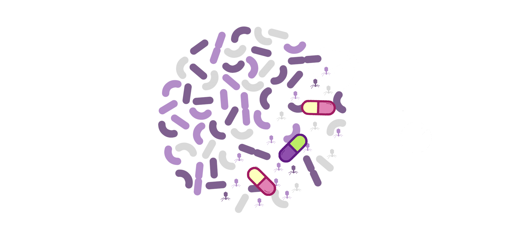

# Gut Bacterial Communities of Healthy Individuals Resilient to Prophage Induction by Antibiotics

Project for looking at prophage induction of MAGs by antibiotics. Using previously published dataset.

List of directories:

* 0_RawData : Downloaded Sequences
* 1_QCReads : Quality controlled reads (Trimmed/Removed Host)
* 2_BacterialAnalysis : Assembly, binning, and taxonomy
* 3_ViralAnalysis : Prophages and Viral Assembled Phages

## Kang dataset:
Kang *et al* 2021, *Gut Microbes*
 [DOI](https://doi.org/10.1080/19490976.2021.1900995)

### Description

10 healthy human volunteers were recruited and randomized to receive one in four different antibiotic courses or to be a control. Before, during, and after 
exposure to antibiotics, they provided a total of six stool samples. Four antibiotics were selected based on their clinical relevance and broad-spectrum activity against 
Gram-positive and/or Gram-negative organisms.

Four antibiotics from different chemical and therapeutic classes were used: ciprofloxacin (quinolone class), cefuroxime (β-lactam class), doxycycline (tetracycline class), 
and azithromycin (macrolide class). As a control, stool samples from two untreated healthy individuals also were processed.

